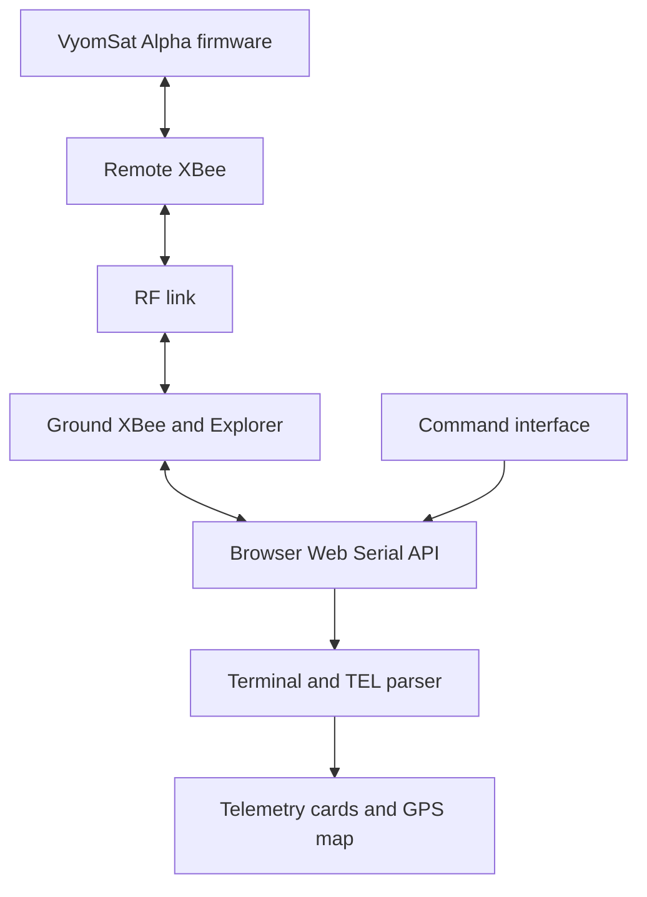

<p align="center">
  <a href="https://www.vyomsat.com">
    
  </a>
</p>

<h1 align="center">VyomSat Alpha Ground Station</h1>

<p align="center">
  A browser-based mission console for live USB telemetry, spacecraft commands,
  parsed health data, and GPS visualization for VyomSat Alpha.
</p>

<p align="center">
  <a href="https://github.com/vyomsat/vyomsat-alpha-ground-station/blob/main/LICENSE.txt"></a>
  
  
  <a href="https://github.com/vyomsat/vyomsat-alpha"></a>
</p>

## Overview

VyomSat Alpha Ground Station is a responsive, single-file web application that communicates directly with a USB serial device through the browser's Web Serial API. It is designed for the transparent XBee radio link used by the [VyomSat Alpha](https://github.com/vyomsat/vyomsat-alpha) educational CubeSat platform.

The application connects to a ground XBee module through an XBee Explorer USB adapter, displays incoming serial data, sends the one-character commands supported by the VyomSat Alpha firmware, parses `TEL` telemetry packets, and presents the latest spacecraft health and location data in a full-screen mission dashboard.

No application server, package manager, framework, compilation step, or backend database is required.

> [!IMPORTANT]
> This software is intended for education, development, and laboratory testing. It is not certified for operational spacecraft control, safety-critical systems, or flight operations.

## Contents

- [Key features](#key-features)
- [System architecture](#system-architecture)
- [Requirements](#requirements)
- [Default serial configuration](#default-serial-configuration)
- [Quick start](#quick-start)
- [Publishing with GitHub Pages](#publishing-with-github-pages)
- [Using the ground station](#using-the-ground-station)
- [Supported commands](#supported-commands)
- [Telemetry packet format](#telemetry-packet-format)
- [GPS map and address behavior](#gps-map-and-address-behavior)
- [Connection settings](#connection-settings)
- [Terminal and log behavior](#terminal-and-log-behavior)
- [Responsive interface](#responsive-interface)
- [Privacy and external services](#privacy-and-external-services)
- [Troubleshooting](#troubleshooting)
- [Code organization](#code-organization)
- [Development and testing](#development-and-testing)
- [Contributing](#contributing)
- [Possible future extensions](#possible-future-extensions)
- [License](#license)

## Key features

- Direct USB serial communication using the Web Serial API.
- Transparent XBee serial link support with configurable serial parameters.
- Live color-coded terminal for received data, transmitted commands, acknowledgements, system messages, and errors.
- Quick-command sidebar divided into Operations and Tests categories.
- Manual one-character command entry with configurable line endings.
- Automatic CR+LF parser synchronization after connection.
- Latest parsed telemetry cards for battery, power, GPS status, satellite count, coordinates, altitude, and mission cycle.
- Satellite imagery map centered on the latest valid coordinates.
- Approximate address lookup from received latitude and longitude.
- Movement and time thresholds that prevent unnecessary map reloads.
- CSV log download with ISO timestamps, direction, and raw data.
- Configurable terminal formatting, line buffering, character delay, line delay, local echo, wake lock, and connection notifications.
- Optional serial control-line display and BREAK signaling.
- Responsive dashboard with collapsible desktop navigation and mobile slide-out panels.
- Accessible labels, keyboard behavior, ellipsis handling, and custom high-contrast tooltips.

## System architecture

The ground station uses the XBee modules as a transparent serial bridge. The browser communicates with the ground XBee through USB. The corresponding remote XBee passes the serial data to and from VyomSat Alpha.



### Receive path

1. VyomSat Alpha generates serial telemetry or command responses.
2. The remote XBee transmits the serial stream over the configured RF link.
3. The XBee Explorer exposes the ground radio as a USB serial device.
4. The browser reads byte chunks and decodes them using the selected character set.
5. The line-framing service separates CR, LF, or CR+LF terminated messages.
6. Every complete line is shown in the terminal.
7. Lines containing the `TEL,` prefix are parsed into telemetry fields.
8. Relevant fields update the telemetry cards, map coordinates, marker location, and approximate address.

### Command path

1. The operator selects a quick command or enters one character manually.
2. The application validates that the command contains exactly one character.
3. The selected send suffix is appended. CR+LF is the VyomSat default.
4. The complete payload is written through one managed Web Serial writer lock.
5. When local echo is enabled, the transmitted command appears as a `TX` terminal line.

## Requirements

### Hardware

- VyomSat Alpha with compatible firmware.
- A remote XBee radio connected to the VyomSat Alpha serial interface.
- A ground XBee radio configured for the same network and transparent serial link.
- XBee Explorer or another compatible USB serial adapter.
- A data-capable USB cable.
- For a mobile device, a compatible USB OTG adapter and USB host support.

### Browser and hosting

- A Chromium-based browser with Web Serial support and USB device access.
- The page must normally be served through HTTPS or `localhost`.
- JavaScript must be enabled.
- Internet access is required for Google Fonts, the embedded Google satellite map, the VyomSat branding image, and OpenStreetMap-based address lookup.

The serial terminal and command functions do not require a backend service. Browser and operating-system support for Web Serial can vary, particularly on mobile devices.

## Default serial configuration

The application starts with the parameters used by the VyomSat Alpha setup guide:

| Parameter | Default |
|---|---:|
| Baud rate | 9600 |
| Data bits | 8 |
| Parity | None |
| Stop bits | 1 |
| Flow control | None |
| Web Serial buffer | 65,536 bytes |
| Character set | UTF-8 |
| Receive newline | Auto |
| Send newline | CR+LF |
| Local echo | Enabled |
| Auto-scroll | Enabled |
| Timestamps | Enabled |

If the XBee modules or firmware use different settings, update them through the gear icon before connecting. Changes to the serial format or character set require disconnection and reconnection.

## Quick start

### 1. Clone the repository

```bash
git clone https://github.com/vyomsat/vyomsat-alpha-ground-station.git
cd vyomsat-alpha-ground-station
```

### 2. Keep the application at the repository root

For the simplest local and GitHub Pages deployment, use this structure:

```text
vyomsat-alpha-ground-station/
├── index.html
├── README.md
└── LICENSE.txt
```

Rename `VyomSAT_Alpha_Chrome_Ground_Station.html` to `index.html` before publishing. The application code itself does not depend on the filename.

### 3. Start a local web server

Using Python:

```bash
python -m http.server 8000
```

Then open:

```text
http://localhost:8000
```

You may also use a static-server extension such as Live Server in Visual Studio Code.

> [!NOTE]
> Opening the HTML file directly with a `file://` address may prevent Web Serial, notifications, wake lock, or persistent settings from working correctly. Use HTTPS or `localhost` whenever possible.

## Publishing with GitHub Pages

1. Upload `index.html`, `README.md`, and `LICENSE.txt` to the `main` branch.
2. Open the repository on GitHub.
3. Select **Settings**.
4. Select **Pages** under **Code and automation**.
5. Under **Build and deployment**, choose **Deploy from a branch**.
6. Select the `main` branch and the `/ (root)` folder.
7. Save the configuration.

The expected site address will be:

```text
https://vyomsat.github.io/vyomsat-alpha-ground-station/
```

GitHub Pages provides the HTTPS context required by Web Serial. The operator must still explicitly select and authorize the USB serial device.

## Using the ground station

1. Configure and pair the two XBee radios.
2. Connect the ground XBee to the XBee Explorer.
3. Connect the Explorer to the computer or compatible mobile device.
4. Power on VyomSat Alpha and its remote XBee.
5. Open the Ground Station page.
6. If required, select the gear icon and verify the serial configuration.
7. Select the green **Connect** button.
8. Choose the XBee Explorer or corresponding USB serial device from the browser chooser.
9. Confirm that the top status shows the connected baud rate.
10. Observe incoming data in the terminal and parsed values in the telemetry widget.
11. Select an Operations or Tests command from the sidebar, or enter one character and select **Send**.
12. Select **Disconnect** before unplugging the USB device.

On mobile layouts, the command sidebar closes automatically after a command is successfully transmitted. It remains open when a confirmation is cancelled or the serial write fails.

## Supported commands

The quick commands mirror the current VyomSat Alpha firmware command table. Commands are sent as one lower-case character followed by the configured suffix.

### Operations commands

| Character | Command | Purpose |
|:---:|---|---|
| `a` | IMU Attitude | Request the attitude and IMU report. |
| `b` | Battery Read | Request the battery-voltage report. |
| `c` | Camera Capture | Capture and store an image. |
| `g` | GPS Report | Request position and GPS diagnostics. |
| `h` | System Health | Request the subsystem health summary. |
| `i` | IMU Calibration | Start IMU calibration. Keep the spacecraft still. |
| `r` | System Reset | Reset the controller. The interface requests confirmation. |
| `s` | SD Data Log | Start sensor logging to the SD card. |

### Tests commands

| Character | Command | Purpose |
|:---:|---|---|
| `t` | ADCS Sensing | Run the ADCS sensing test. |
| `u` | Camera Test | Run the camera capture test. |
| `v` | GPS Sensing | Run the GPS sensing test. |
| `w` | SD Card Test | Run the SD write, read, and checksum test. |
| `x` | Integrated Mission | Run the full integrated mission test. The interface requests confirmation. |

> [!CAUTION]
> Reset, calibration, camera, storage, and integrated-test commands can change hardware state or start longer operations. Verify that the spacecraft and test setup are in a safe condition before transmitting them.

Command availability and responses depend on the firmware version installed on VyomSat Alpha. If the firmware command table changes, update both the sidebar markup and this README.

## Telemetry packet format

The dashboard recognizes lines containing the `TEL,` prefix followed by comma-separated `KEY=VALUE` fields.

Example:

```text
TEL,TS=2679600,BAT=3.78,PWR=NORMAL,GPS=FIX,LAT=25.025618,LON=55.136536,ALT=11.5,NSAT=9,N=581
```

### Parsed fields

| Field | Example | Dashboard use |
|---|---|---|
| `TEL` | `TEL` | Identifies a telemetry packet. |
| `TS` | `2679600` | Firmware-provided timestamp or elapsed-time field. It remains visible in the raw terminal line. |
| `BAT` | `3.78` | Battery voltage in volts and battery-status coloring. |
| `PWR` | `NORMAL` | Power-system state. |
| `GPS` | `FIX` | GPS fix state. |
| `LAT` | `25.025618` | Latitude in decimal degrees. |
| `LON` | `55.136536` | Longitude in decimal degrees. |
| `ALT` | `11.5` | Altitude in metres. |
| `NSAT` | `9` | Number of satellites used or reported by the GPS subsystem. |
| `N` | `581` | Mission or telemetry cycle counter. |

Unknown fields remain visible in the raw terminal line and downloaded log even when no dashboard widget consumes them.

### Terminal timestamp versus firmware timestamp

The timestamp shown in the left terminal column is generated by the browser when the line is received. It is separate from the firmware-provided `TS` field inside the telemetry packet.

On compact screens, the terminal displays a shortened `SS.SSS` timestamp to conserve width. The complete timestamp remains available through the tooltip, on larger screens, and in the downloaded CSV log.

## GPS map and address behavior

When a valid `LAT` and `LON` pair is received:

- The coordinate text and Google Maps link update immediately.
- The embedded map uses satellite imagery by default.
- The first valid position loads the map.
- Later map reloads require movement of at least 1 metre from the last rendered position.
- Embedded-map refreshes are limited to no more than once every 6 seconds.
- Address lookup coordinates are grouped to four decimal places for caching.
- Reverse-geocoding requests are limited to no more than once every 30 seconds.
- Up to 50 recent address results are retained in the in-memory cache.

These controls prevent every telemetry packet from reloading the complete map or repeatedly requesting the same address.

The displayed address is approximate and should not be treated as a navigation, safety, recovery, or regulatory reference.

## Connection settings

Select the gear icon in the top menu to open the settings dialog.

### Serial

| Setting | Available values or range |
|---|---|
| Baud rate | 300 to 3,000,000 baud |
| Data bits | 7 or 8 |
| Parity | None, even, or odd |
| Stop bits | 1 or 2 |
| Flow control | None or hardware RTS/CTS |
| Web Serial buffer | 255 to 16,777,216 bytes |
| BREAK duration | 1 to 10,000 ms |
| Control lines | Optional CTS, DCD, DSR, and RI display |

The dialog also provides **Send BREAK** and **Refresh control lines** actions when supported by the selected serial device.

### Terminal

| Setting | Available values |
|---|---|
| Font size | 9 to 28 px |
| Font style | Normal or bold |
| Character set | UTF-8, Windows-1252, or ISO-8859-1 |
| Display mode | Text or hexadecimal for received data |
| Timestamp format | `HH:mm:ss.SSS` or `HH:mm:ss` |
| Displayed line buffer | Unlimited, 1,000, 2,500, 5,000, or 10,000 lines |
| Auto-scroll | Enabled or disabled |
| Connection messages | Enabled or disabled |
| Timestamps | Enabled or disabled |

### Receive and send

| Setting | Available values |
|---|---|
| Receive newline | Auto, CR+LF, LF, or CR |
| Send newline | CR+LF, same as receive, LF, CR, or none |
| Edit mode | Text |
| Line delay | 0 to 60,000 ms |
| Character delay | 0 to 10,000 ms |
| Local echo | Enabled or disabled |
| Clear input after send | Enabled or disabled |

### Miscellaneous

- Keep the screen awake while connected.
- Show a browser connection notification when permission is available.

Settings are stored in browser `localStorage`. Selecting **Restore VyomSAT defaults** repopulates the form with the defaults. Select **Save settings** to apply and persist them.

## Terminal and log behavior

### Line categories

| Label | Meaning |
|---|---|
| `RX` | Data received from the serial device. |
| `TX` | A locally echoed transmitted command. |
| `SYS` | Ground Station status, synchronization, or error messages. |

Acknowledgements, negative acknowledgements, system messages, telemetry, and errors use distinct theme colors for faster scanning.

### Toolbar actions

- **Sample data** adds representative telemetry and response lines for interface testing.
- **Clear** removes the terminal content, in-memory log, parsed telemetry, and current map state.
- **Download log** exports a CSV file containing ISO timestamp, direction, and raw data.

These actions are enabled only while a serial connection is active. The downloadable log retains up to 20,000 entries in memory. The terminal display has its own configurable line limit.

## Responsive interface

The application is designed as a full-screen mission dashboard rather than a vertically scrolling document.

- On wide screens, commands remain in the left sidebar and mission visualizations remain in the right column.
- The left sidebar can collapse to icon-only mode.
- On smaller screens, commands open through the left menu button.
- Mission panels open through the rightmost top-menu button.
- Widget headers use compact spacing, icons, single-line titles, and ellipsis handling.
- Terminal timestamps and typography are reduced on compact displays.
- A successfully transmitted mobile quick command closes the command drawer automatically.

## Privacy and external services

The Ground Station has no application backend and does not upload raw serial telemetry or command logs to a VyomSat server.

### Stored locally

- Ground Station preferences are stored in browser `localStorage`.
- Terminal entries are retained in memory until the page is refreshed or the terminal is cleared.
- CSV files are generated locally in the browser.

### External network requests

The application currently loads or contacts:

- Google Fonts for the interface typefaces.
- `vyomsat.com` for the branding icon.
- Google Maps for satellite imagery and map links.
- OpenStreetMap Nominatim for approximate reverse-geocoded addresses.

When the map and address functions are used, the received coordinates are included in requests to the respective mapping services. Other raw telemetry fields and command logs are not sent by the application.

Organizations with strict privacy, offline-lab, or network-isolation requirements should self-host the visual assets and disable or replace external map and reverse-geocoding services.

## Troubleshooting

| Problem | Checks and corrective actions |
|---|---|
| Connect button is unavailable | Use a browser with Web Serial support. Serve the page through HTTPS or `localhost`. Confirm that JavaScript and USB access are allowed. |
| USB device does not appear | Use a data-capable cable, reconnect the XBee Explorer, check USB or OTG support, and close other serial-terminal applications that may own the port. |
| Connected but no telemetry appears | Verify VyomSat power, both XBee modules, matching network settings, transparent mode, UART wiring, radio association, and 9600 baud configuration. |
| Telemetry is unreadable | Confirm baud rate, data bits, parity, stop bits, character set, and that no other application is reading the same port. |
| Telemetry works but commands do not | Keep the send newline set to CR+LF, verify the firmware command parser, confirm the remote XBee serial path, and look for `ACK`, `NAK`, or firmware response lines. |
| Command drawer does not close on mobile | It closes only after a successful serial write. Cancelled confirmation dialogs and failed transmissions intentionally leave it open. |
| Telemetry cards do not update | Confirm that lines contain the exact `TEL,` prefix and comma-separated `KEY=VALUE` fields. |
| Map remains blank | Confirm that valid numeric `LAT` and `LON` fields are present and that the browser can access Google Maps. |
| Map does not refresh for small movements | This is intentional. Movement below 1 metre does not reload the embedded map, and reloads are limited to once every 6 seconds. |
| Address remains unavailable | Check internet access and content restrictions. The address service is rate-limited and the coordinates remain authoritative even when lookup fails. |
| Control lines are unavailable | Not every browser, operating system, driver, or USB serial adapter exposes control-line status. |
| Settings do not persist | Use HTTPS or `localhost`, and confirm that browser privacy settings permit local storage. |

## Code organization

The application intentionally remains a single HTML file so it can be distributed and hosted easily. Within that file, the code is organized into clearly documented responsibilities:

1. **Design tokens and CSS components** define the visual system and responsive behavior.
2. **Application configuration** centralizes breakpoints, storage keys, terminal limits, map thresholds, and protocol constants.
3. **DOM composition and registry** moves reusable panels into their dashboard positions and validates required elements.
4. **State containers** isolate serial, terminal, telemetry, map, and browser-integration state.
5. **Tooltip service** converts relevant native titles into consistent themed tooltips.
6. **Persistence and layout** manage saved preferences and responsive panels.
7. **Terminal protocol** performs timestamping, line framing, display classification, logging, and command-suffix handling.
8. **Telemetry and map services** parse `TEL` packets, update widgets, calculate movement, throttle the map, and resolve addresses.
9. **Browser integrations** manage wake lock, notifications, control lines, and BREAK signaling.
10. **Web Serial transport** manages connection, read loops, writer locks, command transmission, and disconnection cleanup.
11. **Event binding and bootstrap** register interface events and initialize the application in a predictable order.

### Coding conventions

- Immutable constants use `UPPER_SNAKE_CASE`.
- Functions, state, and DOM references use `camelCase`.
- One-time setup functions begin with `initialize`.
- Event callbacks begin with `handle`.
- Interface synchronization functions begin with `render`, `update`, or `set`.
- Mutable state is grouped by responsibility and sealed to prevent accidental shape changes.
- Serial writer ownership is centralized so writer locks are always released.
- Required DOM elements fail early with descriptive errors.
- Comments explain protocol constraints and design decisions rather than restating individual statements.
- Semantic HTML, ARIA labels, keyboard behavior, and responsive focus management should be preserved.

## Development and testing

There is no build step. Edit `index.html`, start a local HTTPS or localhost server, and reload the page.

### Recommended regression checklist

Before submitting a change, verify:

- [ ] The page loads without console errors.
- [ ] Connect displays the browser serial-device chooser.
- [ ] The default port opens at 9600 baud, 8-N-1, with no flow control.
- [ ] Received CR, LF, and CR+LF lines are framed correctly.
- [ ] A command such as `a` is transmitted as `a\r\n` with default settings.
- [ ] Multi-character manual commands are rejected.
- [ ] Operations and Tests commands match the current firmware.
- [ ] Caution commands still request confirmation.
- [ ] Mobile quick commands close the sidebar only after successful transmission.
- [ ] `TEL` packets update every relevant telemetry field.
- [ ] Invalid coordinates do not update the map.
- [ ] Map reloads respect the 1 metre and 6 second limits.
- [ ] Address lookup respects caching and request throttling.
- [ ] Clear resets terminal, log, telemetry, and map state.
- [ ] Download log creates a valid CSV file.
- [ ] Settings persist after reload and serial changes request reconnection.
- [ ] Desktop, tablet, and mobile layouts remain usable without horizontal page overflow.
- [ ] Keyboard focus and tooltips remain available for interactive controls.

### Suggested commit prefixes

```text
feat:      add a new operator capability
fix:       correct behavior or a regression
refactor:  improve code without changing behavior
docs:      update documentation
style:     change visual presentation without changing logic
test:      add or update validation
chore:     repository maintenance
```

## Contributing

Contributions that improve reliability, accessibility, documentation, testing, telemetry visualization, or compatibility are welcome.

1. Fork the repository.
2. Create a focused branch:

   ```bash
   git checkout -b feat/short-description
   ```

3. Make the smallest coherent change.
4. Preserve the default VyomSat serial settings and one-character command protocol unless the firmware changes.
5. Complete the regression checklist.
6. Commit with a clear message.
7. Push the branch and open a pull request.

Pull requests should explain:

- What changed.
- Why the change is required.
- Which browser and operating system were tested.
- Which XBee Explorer or USB serial adapter was used, when applicable.
- Whether the change affects the firmware command table or telemetry schema.
- Screenshots for visual changes.

Please use the [issue tracker](https://github.com/vyomsat/vyomsat-alpha-ground-station/issues) for reproducible bugs and focused feature proposals. Do not post private coordinates, serial logs containing sensitive data, or security credentials.

## Possible future extensions

- Live Sky Map using received location and time data.
- Configurable telemetry alarms and threshold notifications.
- Historical charts for battery, altitude, GPS quality, and mission cycles.
- Packet recording and replay for classroom demonstrations.
- Firmware-version-aware command profiles.
- Offline visual assets and optional offline map support.
- Progressive Web App packaging for supported devices.
- Automated browser tests with a mock Web Serial transport.

These items describe possible directions and are not committed release dates.

## Related project

The hardware, firmware, documentation, and educational context for the spacecraft platform are available in the main repository:

- [VyomSat Alpha](https://github.com/vyomsat/vyomsat-alpha)
- [VyomSat website](https://www.vyomsat.com)

## License

This project is released under the [Apache License, Version 2.0](LICENSE.txt).

Copyright (c) 2026 VyomSat. All rights reserved except as granted under the Apache License, Version 2.0.
